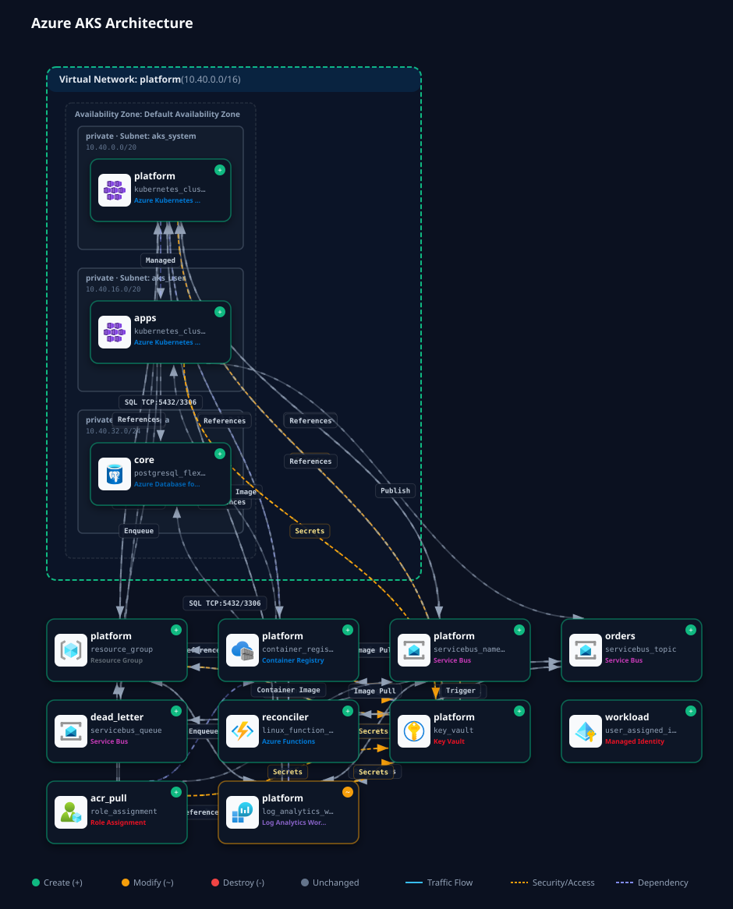

# Azure AKS Terraform Infrastructure

[](https://github.com/mchittineni/aks-terraform/actions/workflows/validate.yml)
[](https://github.com/mchittineni/aks-terraform/actions/workflows/plan.yml)
[](LICENSE)
[](https://www.terraform.io/)
[](https://registry.terraform.io/providers/hashicorp/azurerm/latest)
[](https://kubernetes.io/)
[](https://github.com/mchittineni/tf-arch-diagram-generator)
[](https://github.com/features/actions)
[](https://github.com/terraform-linters/tflint)

A production-grade, modular Infrastructure-as-Code (IaC) solution for provisioning a secure, highly-available **Azure Kubernetes Service (AKS)** environment with automated CI/CD pipelines, security compliance auditing, and interactive cloud architecture diagram generation.

---

## Architecture Overview

The infrastructure provisions a scalable enterprise architecture in Microsoft Azure:



- **Compute**: Azure Kubernetes Service (AKS) managed cluster running Kubernetes `1.32` with system node pools, Azure CNI, managed identities, and Key Vault integration.
- **Networking**: Azure Virtual Network (VNet) segmented into dedicated subnets for AKS worker nodes and database tiers with Network Security Groups (NSGs).
- **Database**: Azure SQL Server and Database with automated backup retention, auditing policies, and private network access.
- **Monitoring**: Azure Log Analytics Workspace with Container Insights and Azure Monitor Action Groups for alerting.
- **Architecture Visualizer**: Automated plan-to-diagram visualization powered by [`tf-arch-diagram-generator`](https://github.com/mchittineni/tf-arch-diagram-generator).

---

## Repository Layout

```
aks-terraform/
├── .github/workflows/        # Production CI/CD pipelines (Validate, Plan, Apply, Destroy, Diagram)
├── docs/                     # Architecture, CI/CD pipeline, and deployment guides
├── modules/
│   └── azure/
│       ├── compute/          # AKS cluster, node pools, identities, and RBAC
│       ├── database/         # Azure SQL server, database, and firewall rules
│       ├── monitoring/       # Log Analytics, Container Insights, and alerts
│       └── networking/       # Resource group, VNet, subnets, and NSGs
├── scripts/
│   └── generate_diagram.sh   # Architecture diagram generator CLI helper
├── main.tf                   # Root configuration & module orchestration
├── variables.tf              # Input variables with validation rules
├── outputs.tf                # Cluster endpoints, IDs, and kubeconfig command
├── terraform.tfvars.example  # Example variable definitions
├── .checkov.yml              # Checkov security baseline
└── .tflint.hcl               # TFLint ruleset for Azure
```

---

## Quick Start

### 1. Prerequisites
- [Terraform](https://developer.hashicorp.com/terraform/downloads) `>= 1.16.1`
- [Azure CLI](https://learn.microsoft.com/en-us/cli/azure/install-azure-cli) `az`
- [kubectl](https://kubernetes.io/docs/tasks/tools/) `>= 1.30`
- [Node.js](https://nodejs.org/) `>= 22` (optional, for diagram generation)

### 2. Local Initialization
```bash
# Login to Azure
az login

# Set Azure Subscription
az account set --subscription "<SUBSCRIPTION_ID>"

# Copy and configure variables
cp terraform.tfvars.example terraform.tfvars

# Initialize Terraform
terraform init

# Validate configuration
terraform validate

# Review plan
terraform plan
```

### 3. Generate Architecture Diagram
```bash
# Generate architecture SVG
./scripts/generate_diagram.sh dev

# Launch interactive browser viewer with traffic spotlighting
./scripts/generate_diagram.sh --serve
```

---

## CI/CD Automation

This repository includes production-ready GitHub Actions workflows:

1. **Validation & Security (`validate.yml`)**: Runs `terraform fmt`, `terraform validate`, `tflint`, and Checkov static analysis on pull requests and commits.
2. **Plan & Diagram (`plan.yml`)**: Authenticates via Azure OIDC, runs `terraform plan`, renders an architecture diagram, and comments the summary on the PR.
3. **Continuous Deployment (`apply.yml`)**: Applies approved changes on merge to `main`.
4. **On-Demand Diagram (`diagram.yml`)**: Regenerates and commits updated diagrams when infrastructure code changes.
5. **Controlled Teardown (`destroy.yml`)**: Safeguarded manual destruction requiring explicit confirmation.

---

## Documentation

- [Architecture Specification](docs/architecture.md)
- [CI/CD Pipeline Guide](docs/ci-cd-pipeline.md)
- [Deployment Guide](docs/deployment-guide.md)

---

## License
MIT License. Created by [Manideep Chittineni](https://github.com/mchittineni).
